# Event Ticketing System
Midterm project for CPSC 449  
Cassandra Santillano  
CWID: 884464942 

---
### Overview:
This project is an event ticketing system, that is a RESTful backend application using Spring Boot and PostgreSQL.
It is a practical implementation of common backend practices, such as returning proper HTTP status codes and
using @Transactional to avoid any potential idempotency issues. This project utilizes a three-layer architecture
and handles relationships between organizers, venues, events, and attendees.

---

### Endpoints include:
* POST /api/organizers
* POST /api/venues
* POST /api/events
* POST /api/tickettypes
* GET /api/events
* GET /api/events/{eventId}
* POST /api/attendees
* POST /api/bookings
* PUT /api/bookings/{id}/cancel
* GET /api/events/{eventId}/revenue
* GET /api/attendees/{attendeeId}/bookings

---
## Screenshots
### Create an organizer:
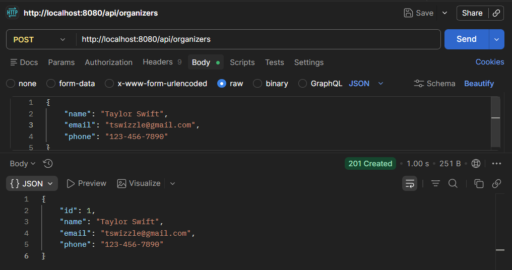

### Create a venue:
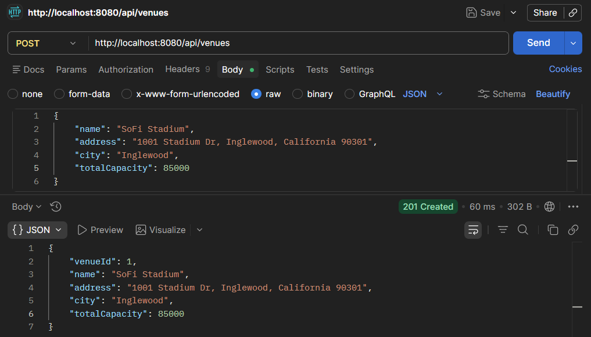

### Create a new event:
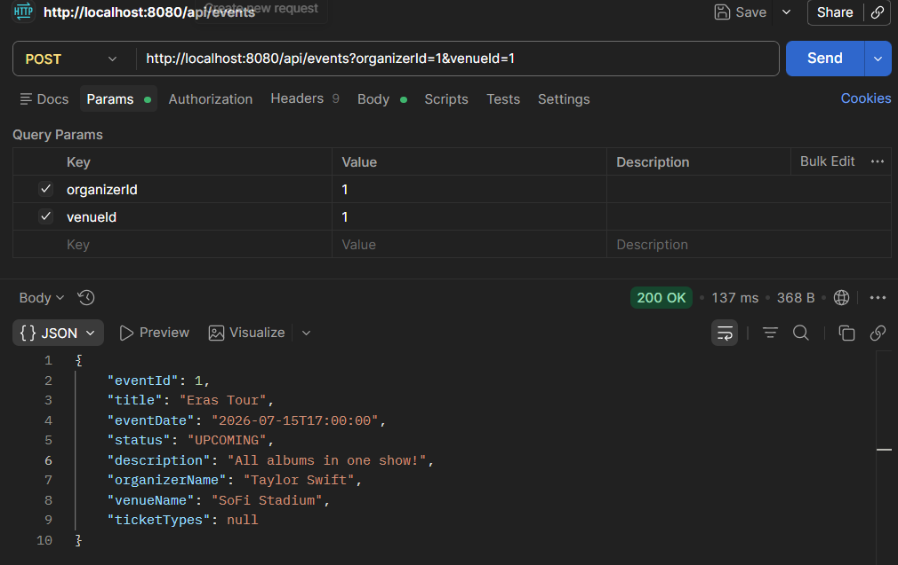

### Create a ticket type:
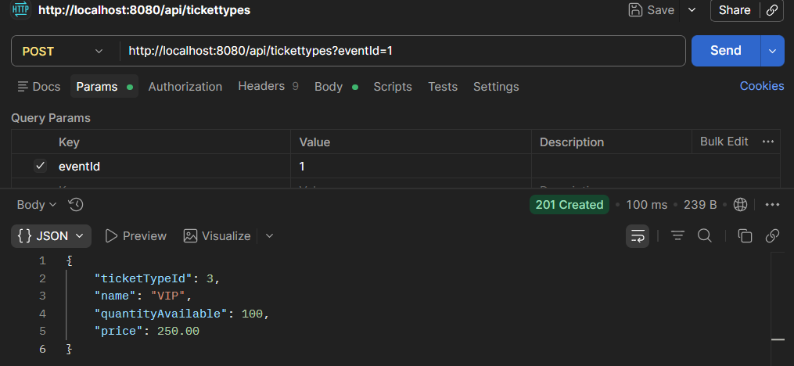

### List all upcoming events:
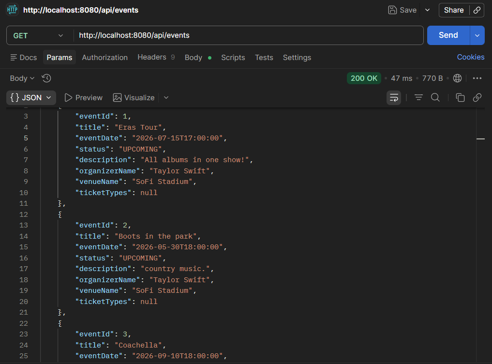

### Get event details with ticket types:
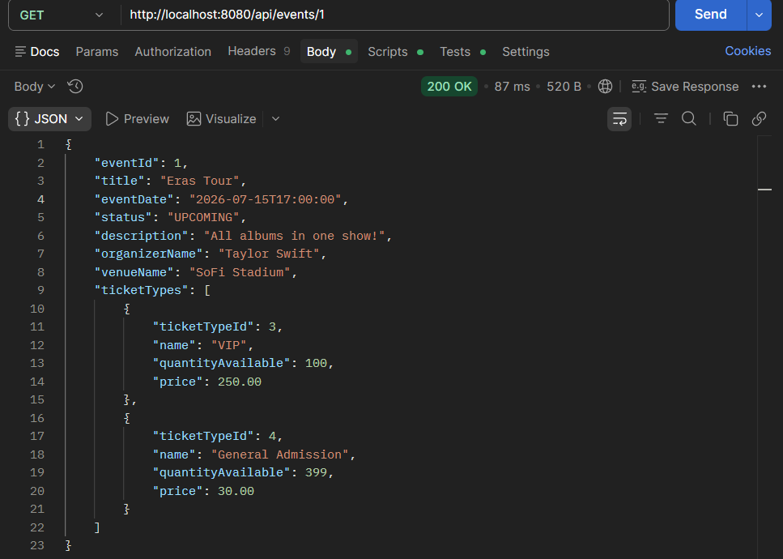

### Register a new attendee
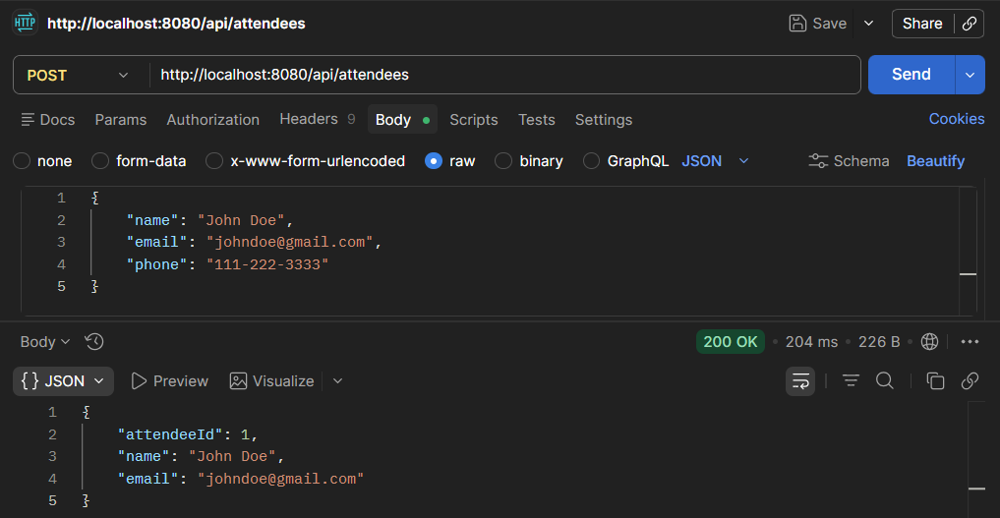

### Book a ticket
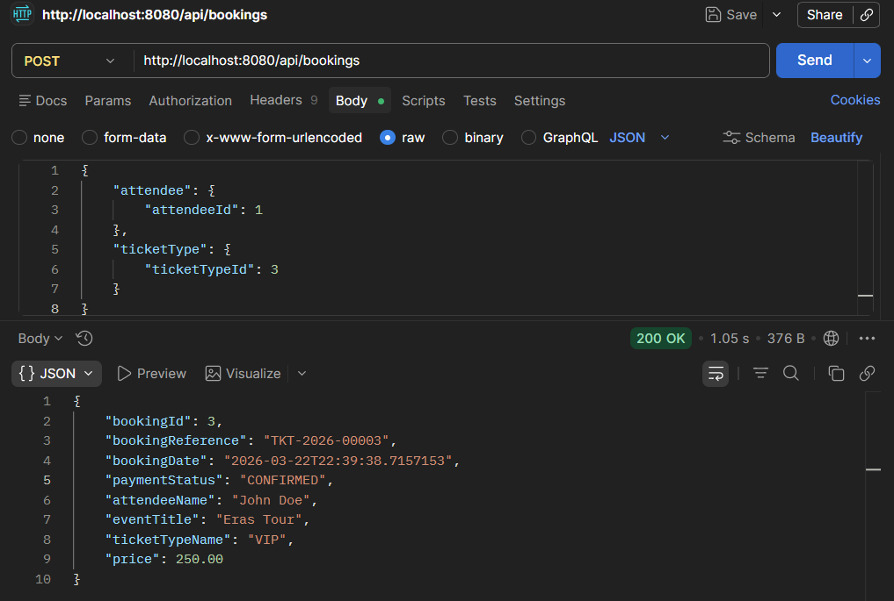

### Cancel a booking
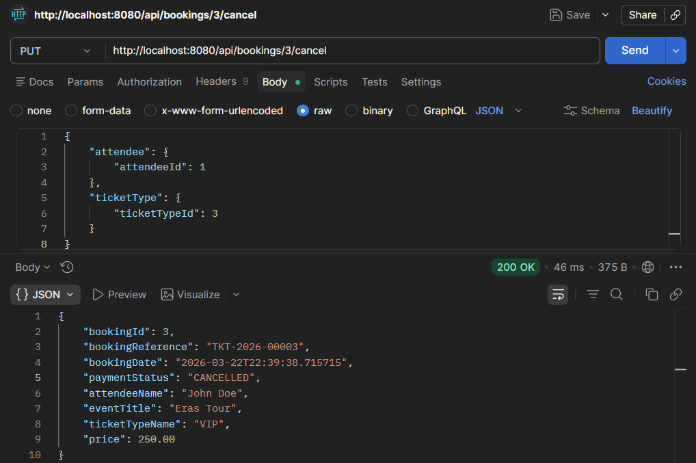

### Get total revenue for an event
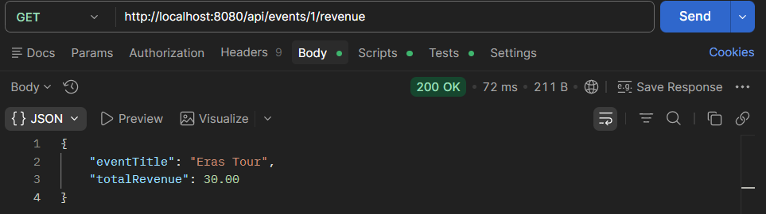

### Get all bookings for an attendee
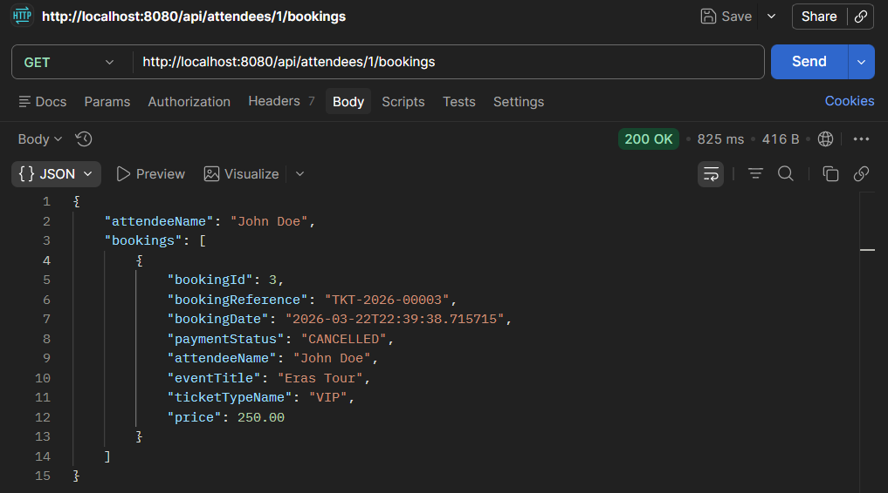